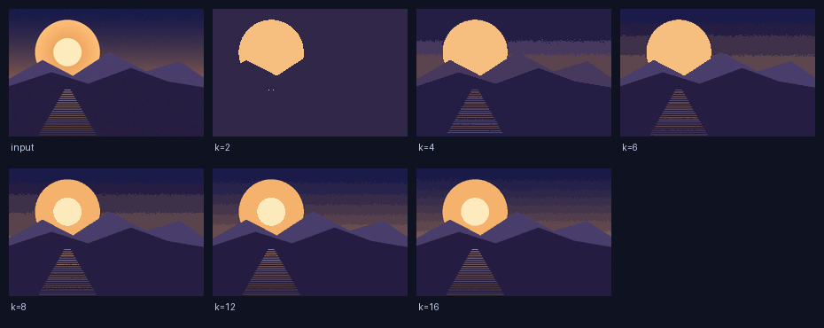
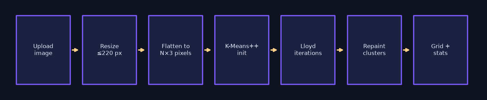
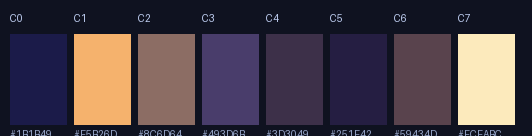
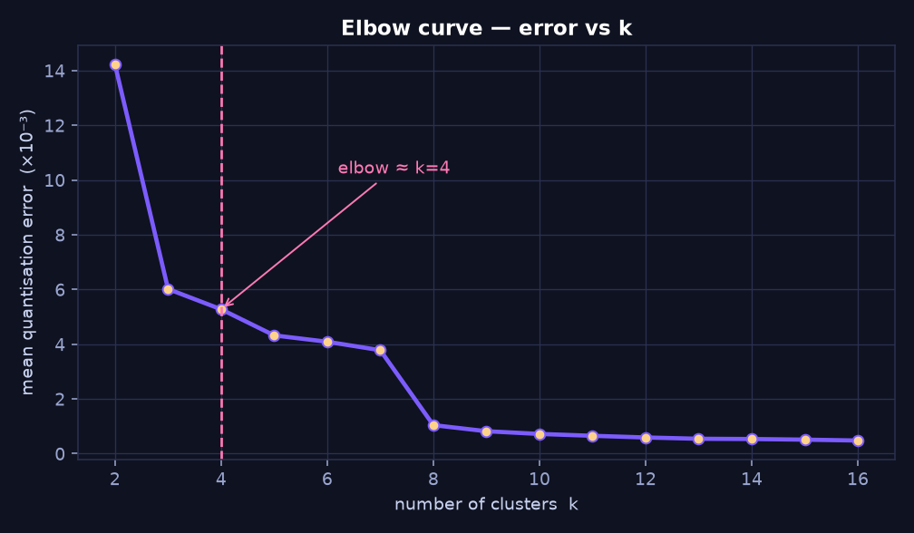
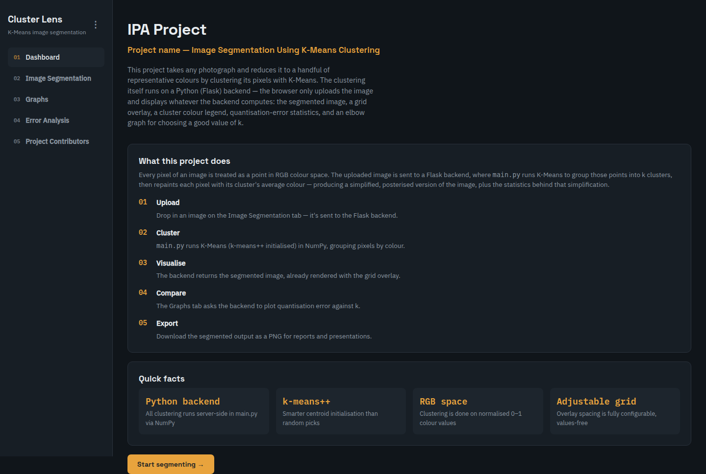
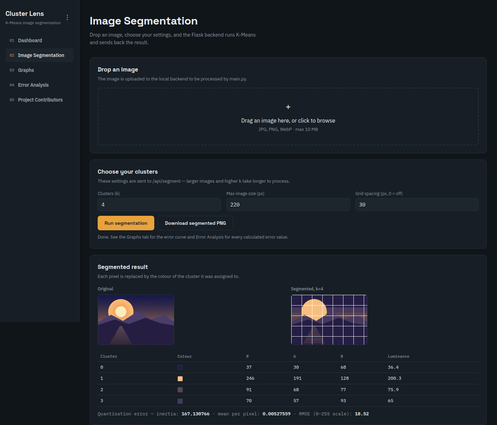
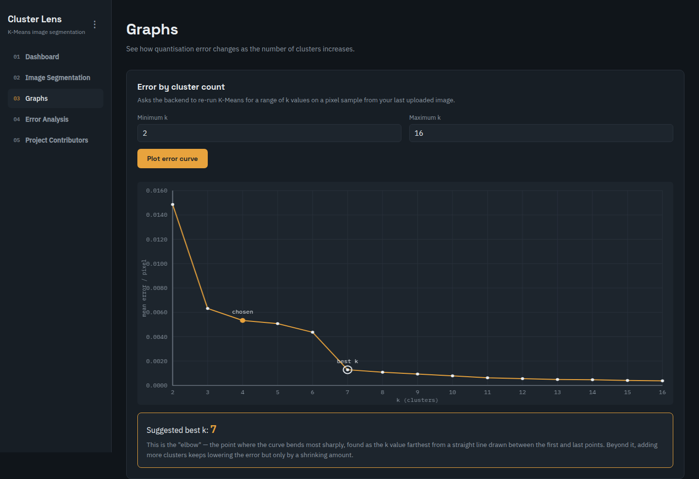
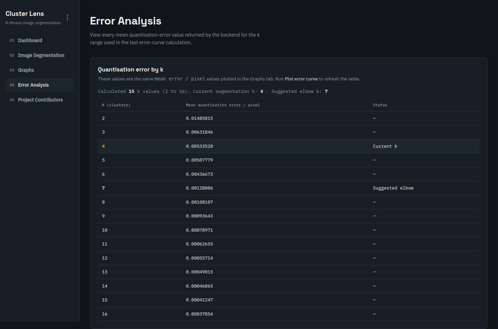
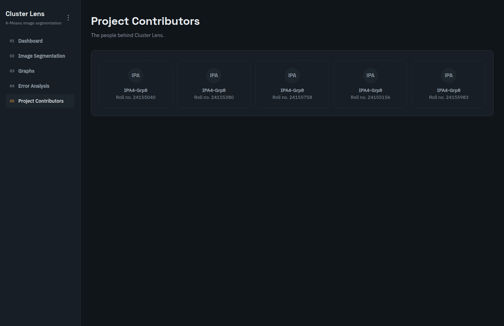

# Cluster Lens — Image Segmentation Using K-Means Clustering

> **IPA4-Grp8** · Course project · Image Processing & Analysis (IPA)
> An interactive web application that reduces any photograph to *k* representative
> colours by clustering its pixels in RGB space with K-Means.

<p align="center">
  
  <br>
  <em>One input photograph segmented at six different cluster counts — every panel is real output from <code>main.py</code>.</em>
</p>

---

## Table of contents

1. [What this project does](#1-what-this-project-does)
2. [Why K-Means](#2-why-k-means)
3. [Method and pipeline](#3-method-and-pipeline)
4. [Results](#4-results)
5. [Cluster colour tables](#5-cluster-colour-tables)
6. [Choosing k — the elbow curve](#6-choosing-k--the-elbow-curve)
7. [Application screenshots](#7-application-screenshots)
8. [Project structure](#8-project-structure)
9. [Running the project](#9-running-the-project)
10. [API reference](#10-api-reference)
11. [Testing](#11-testing)
12. [Reproducing the figures](#12-reproducing-the-figures)
13. [Complexity and efficiency](#13-complexity-and-efficiency)
14. [Limitations and future scope](#14-limitations-and-future-scope)
15. [Team — IPA4-Grp8](#15-team--ipa4-grp8)

---

## 1. What this project does

Every pixel in an image is a point in three-dimensional RGB colour space. Photographs
contain tens of thousands of *distinct* colours, but the human eye reads a scene in only
a handful of meaningful tones — sky, foliage, skin, shadow. **Cluster Lens** finds those
dominant tones automatically.

The application:

1. **Accepts** any JPG / PNG / WebP upload from the browser (limit 10 MB).
2. **Clustering runs in Python on the backend** using NumPy — not in JavaScript.
3. **Groups** all pixels into *k* clusters with K-Means, then **repaints** every pixel with
   the mean colour of its cluster, producing a posterised / segmented image.
4. **Quantifies** the loss with an inertia figure, mean error per pixel, and RMSE on the
   0–255 scale.
5. **Plots** the error-versus-k curve so you can pick a sensible *k* instead of guessing.
6. **Exports** the segmented result as a PNG.

<p align="center">
  
</p>

---

## 2. Why K-Means

| Property | Benefit for this problem |
|---|---|
| **Unsupervised** | No labelled training data is needed — the clusters are discovered from the image itself. |
| **Colour-space native** | Pixels are already vectors in ℝ³ (R, G, B); Euclidean distance is a natural measure of colour similarity. |
| **Fixed output size** | The user picks *k* directly, so output size is predictable and controllable. |
| **Extremely cheap at inference** | Assigning a pixel is a nearest-centroid lookup — linear in *k*, no learned parameters. |
| **Interpretable** | Each cluster centre *is* a colour, so the model output can be shown as a legend of hex codes. |

The main practical weakness of plain K-Means is sensitivity to initialisation, which is
why this implementation uses **k-means++ seeding** (see below) rather than random starts.

---

## 3. Method and pipeline

### 3.1 Pre-processing

```python
# main.py — load_image_from_bytes()
largest = max(width, height)
if largest > max_size:
    scale = max_size / largest
    img = img.resize((int(width * scale), int(height * scale)),
                     Image.Resampling.LANCZOS)
pixels = image_rgb.reshape(-1, 3).astype(np.float64) / 255.0
```

The image is converted to RGB, downscaled so its longest edge is at most `max_size`
(default **220 px**) using Lanczos resampling, and its pixels are flattened into an
`(N, 3)` matrix normalised to `[0, 1]`. Working at this resolution keeps clustering
interactive while preserving the colour distribution — the quantities being clustered are
colours, not spatial detail.

### 3.2 k-means++ initialisation

Random seeding can place two centroids inside the same colour region and leave another
region unrepresented, producing a poor local minimum. k-means++ instead picks the first
centre uniformly at random and every subsequent centre with probability proportional to
its squared distance from the nearest existing centre:

```python
# main.py — _kmeans_plusplus_init()
closest_dist_sq = np.sum((pixels - centers[0]) ** 2, axis=1)
for c in range(1, k):
    probs = closest_dist_sq / closest_dist_sq.sum()
    idx = rng.choice(n, p=probs)
    centers[c] = pixels[idx]
    closest_dist_sq = np.minimum(closest_dist_sq,
                                 np.sum((pixels - centers[c]) ** 2, axis=1))
```

This spreads the initial centroids across colour space and converges in fewer iterations
to a lower-error solution.

### 3.3 Lloyd's algorithm (assignment + update)

```python
for _ in range(iterations):
    labels, _ = _assign_clusters(pixels, centers)      # ASSIGN
    for c in range(k):                                 # UPDATE
        mask = labels == c
        if np.any(mask):
            new_centers[c] = pixels[mask].mean(axis=0)
    if np.allclose(new_centers, centers, atol=1e-6):   # CONVERGED
        break
    centers = new_centers
```

Each iteration **assigns** every pixel to its nearest centroid and **moves** each centroid
to the mean of its members. The loop exits early once the centroids stop moving
(`atol = 1e-6`), so most images converge well before the iteration cap.

The assignment step is written to avoid allocating an `(N, k, 3)` temporary array, which
would be the dominant memory cost at high resolution:

```python
# main.py — _assign_clusters()
distances = (np.sum(pixels * pixels, axis=1)[:, None]
             + np.sum(centers * centers, axis=1)[None, :]
             - 2 * pixels @ centers.T)
np.maximum(distances, 0, out=distances)
labels = np.argmin(distances, axis=1)
```

This is the expanded ‖p‖² + ‖c‖² − 2p·c form: one BLAS matrix product instead of a
broadcasted subtraction over all *k* centroids, and only an `(N, k)` output. The
`np.maximum(..., 0)` guard removes tiny negative values caused by floating-point error.

### 3.4 Reconstruction and error

```python
centers_255 = np.clip(centers * 255, 0, 255).astype(np.uint8)
segmented_image = centers_255[labels].reshape(height, width, 3)
```

Every pixel is repainted with its cluster's mean colour. The objective being minimised is
the within-cluster sum of squares, reported as **inertia**:

$$J = \sum_{i=1}^{N} \lVert x_i - \mu_{c(i)} \rVert^2$$

from which the interface reports mean error per pixel `J / N` and
`RMSE = sqrt(J / N) × 255` so the error can be read on the familiar 0–255 colour scale.

### 3.5 Grid overlay and legend

`add_grid()` draws evenly spaced white grid lines over the segmented output so cluster
regions are visually countable, and `cluster_legend()` reports each centre as R, G, B and
perceived luminance (`0.299R + 0.587G + 0.114B`).

---

## 4. Results

All figures below were produced by `docs/make_figures.py`, which runs the real code in
`main.py`. The benchmark image is a 640 × 420 synthetic sunset scene with gradients, haze
and film grain, resized to **220 × 144 = 31,680 pixels** for clustering, with
**30 iterations** and a fixed seed (`42`) for reproducibility.

### 4.1 Quantisation error versus cluster count

| k | Inertia (J) | Mean error / pixel | RMSE (0–255) | Colours saved | RMSE vs. k=2 |
|---:|---:|---:|---:|---:|---:|
| 2 | 450.5526 | 0.01422199 | 30.41 | 15,840× | — |
| 4 | 167.1307 | 0.00527559 | 18.52 | 7,920× | −39.1% |
| 6 | 129.5452 | 0.00408918 | 16.31 | 5,280× | −46.4% |
| 8 | 33.0101 | 0.00104198 | 8.23 | 3,960× | −72.9% |
| 12 | 18.7260 | 0.00059110 | 6.20 | 2,640× | −79.6% |
| 16 | 15.1822 | 0.00047924 | 5.58 | 1,980× | −81.7% |

*"Colours saved" = N / k, the compression achieved.

<p align="center">
  
  
</p>

**Reading the table.** Error falls steeply from k = 2 → 4 (RMSE 30.41 → 18.52) and then
improves only gradually. Between k = 4 and k = 16 the error drops another 70%, but the
image already reads correctly at k = 4: the scene resolves into sky, sun, mountains and
water. This is the classic diminishing-returns behaviour that motivates the elbow method.

The jump between k = 6 (RMSE 16.31) and k = 8 (RMSE 8.23) is not noise — it marks the
point at which the algorithm can finally separate the two mountain layers and the water
from each other instead of averaging them into single tones.

### 4.2 Per-k visual comparison

<p align="center">
  
</p>

At **k = 2** the image collapses to a dark and a light tone — recognisably a silhouette,
but all structure is gone. **k = 4** separates sky, sun, far mountains and water.
**k = 8** adds the warm horizon band and the near-mountain shadow. Beyond **k = 12** the
gains are subtle: the palette is already describing the image faithfully.

---

## 5. Cluster colour tables

These are the actual centroid colours returned by `main.py` for the benchmark image,
exactly as the application prints them in its cluster legend.

### k = 4

| Cluster | Swatch | R | G | B | Luminance | Region it captures |
|---:|:---:|---:|---:|---:|---:|---|
| 0 | ⬛ `#251E44` | 37 | 30 | 68 | 36.4 | Deep shadow / water base |
| 1 | 🟨 `#F6BF80` | 246 | 191 | 128 | 200.3 | Sun disc and glow |
| 2 | 🟫 `#5B444D` | 91 | 68 | 77 | 75.9 | Far mountain haze |
| 3 | 🟪 `#46395D` | 70 | 57 | 93 | 65.0 | Sky-to-mountain transition |

### k = 8

| Cluster | Swatch | R | G | B | Luminance | Region it captures |
|---:|:---:|---:|---:|---:|---:|---|
| 0 | ⬛ `#1B1B49` | 27 | 27 | 73 | 32.2 | Upper sky / deep water |
| 1 | 🟧 `#F5B26D` | 245 | 178 | 109 | 190.2 | Sun and reflected streak |
| 2 | 🟫 `#8C6D64` | 140 | 109 | 100 | 117.2 | Bright mountain edge |
| 3 | 🟪 `#493D6B` | 73 | 61 | 107 | 69.8 | Mid-sky gradient |
| 4 | 🟪 `#3D3049` | 61 | 48 | 73 | 54.7 | Near mountain shadow |
| 5 | ⬛ `#251E42` | 37 | 30 | 66 | 36.2 | Darkest water |
| 6 | 🟫 `#59434D` | 89 | 67 | 77 | 74.7 | Distant haze band |
| 7 | ⬜ `#FCEABC` | 252 | 234 | 188 | 234.1 | Sun core highlight |

<p align="center">
  
  <br>
  <em>The k = 8 palette extracted from the image, with hex codes and luminance.</em>
</p>

Note how luminance ordering tracks the scene's depth ordering: the brightest clusters are
the sun, and the darkest are the deep water and shadowed mountains. That correlation is a
useful sanity check that the clustering is capturing structure rather than noise.

---

## 6. Choosing k — the elbow curve

<p align="center">
  
</p>

Mean quantisation error (× 10⁻³) for every k from 2 to 16:

| k | 2 | 3 | 4 | 5 | 6 | 7 | 8 | 9 | 10 | 11 | 12 | 13 | 14 | 15 | 16 |
|---|---:|---:|---:|---:|---:|---:|---:|---:|---:|---:|---:|---:|---:|---:|---:|
| **mean error ×10⁻³** | 14.22 | 6.02 | 5.28 | 4.32 | 4.09 | 3.78 | 1.04 | 0.82 | 0.72 | 0.65 | 0.59 | 0.54 | 0.53 | 0.51 | 0.48 |

The curve drops sharply up to **k ≈ 4–6** and then flattens. The application computes this
suggested elbow automatically and offers it to the user as the recommended k. The table is
also surfaced directly in the **Error Analysis** tab, so the numbers behind the chart are
always inspectable rather than hidden behind a plotted line.

---

## 7. Application screenshots

Every screenshot below was captured from the running Flask application in headless Chrome
— these are the real interface, not mock-ups.

### Dashboard



### Image Segmentation



The panes show the original upload beside the segmented output at k = 4, followed by the
cluster legend table (R, G, B and luminance per cluster) and the quantisation-error line
reported by the backend.

### Graphs



### Error Analysis



### Project Contributors



---

## 8. Project structure

```
.
├── main.py                 # ALL segmentation logic: loading, K-Means, grid,
│                           # legend, error stats, elbow curve, PNG encoding
├── app.py                  # Flask server — HTTP routes only, no clustering
├── index.html              # Single-page frontend (Dashboard, Segmentation,
│                           # Graphs, Error Analysis, Contributors)
├── test_main.py            # Unit tests for the clustering core
├── test_advanced.py        # Advanced correctness + efficiency test suite
├── requirements.txt        # Flask, NumPy, Pillow
├── docs/
│   ├── make_figures.py     # Regenerates every figure and metric in this README
│   ├── verify.py           # End-to-end API + asset integrity scan
│   ├── metrics.json        # Measured numbers behind the tables
│   └── *.png               # Figures and application screenshots
└── README.md
```

**Separation of concerns.** `app.py` contains no clustering code — it validates the HTTP
request, calls into `main.py`, and serialises the result. `main.py` contains no Flask
imports, so the entire algorithm is usable and testable from a plain Python shell, and can
be dropped into a script, a notebook, or a batch job unchanged.

### Request flow

```
Browser                app.py                     main.py
   │                      │                          │
   │  POST /api/segment   │                          │
   │  (image, k,          │                          │
   │   max_size,          │                          │
   │   grid_size)         │                          │
   ├─────────────────────>│                          │
   │                      │  validate form fields    │
   │                      ├─────────────────────────>│ load_image_from_bytes()
   │                      │                          │ segment_image()
   │                      │                          │ add_grid()
   │                      │                          │ cluster_legend()
   │                      │                          │ error_stats()
   │                      │<─────────────────────────┤
   │  JSON: original_png, │                          │
   │  segmented_png,      │                          │
   │  legend,             │                          │
   │  error_stats         │                          │
   │<─────────────────────┤                          │
```

---

## 9. Running the project

Requires **Python 3.9+**.

```bash
# 1. Create and activate a virtual environment
python3 -m venv venv
source venv/bin/activate          # Windows: venv\Scripts\activate

# 2. Install dependencies
pip install -r requirements.txt

# 3. Start the server
python app.py
```

Then open **http://127.0.0.1:5000**.

The server binds to `127.0.0.1` and runs with debug mode **off** by default. Both can be
overridden through the environment:

```bash
PORT=8080 python app.py           # change the port
HOST=0.0.0.0 PORT=8080 python app.py
FLASK_DEBUG=1 python app.py       # development reloader (never use in production)
```

Stop the server with `Ctrl+C`.

---

## 10. API reference

### `GET /`
Serves `index.html`.

### `POST /api/segment`
`multipart/form-data`

| Field | Type | Range | Default | Meaning |
|---|---|---|---|---|
| `image` | file | ≤ 10 MB | — | Image to segment (JPG / PNG / WebP) |
| `k` | int | 2–16 | 4 | Number of colour clusters |
| `max_size` | int | 40–500 | 220 | Longest edge of the working image, in pixels |
| `grid_size` | int | 0–200 | 30 | Grid spacing in pixels; `0` disables the grid |

Response `200`:

```json
{
  "width": 220,
  "height": 144,
  "original_png": "<base64 PNG>",
  "segmented_png": "<base64 PNG>",
  "legend": [
    {"cluster": 0, "r": 37, "g": 30, "b": 68, "luminance": 36.4}
  ],
  "error_stats": {"inertia": 167.130688, "mean_error": 0.00527559, "rmse_255": 18.52}
}
```

### `POST /api/elbow`
`multipart/form-data` — same `image` and `max_size` fields, plus:

| Field | Type | Range | Default | Meaning |
|---|---|---|---|---|
| `k_min` | int | 2–16 | 2 | First k in the sweep |
| `k_max` | int | 2–16 | 9 | Last k in the sweep (must be ≥ `k_min`) |

Response `200`:

```json
{"k_values": [2, 3, 4], "mean_errors": [0.01422, 0.00602, 0.00528]}
```

### Errors

Both endpoints return `400` with `{"error": "<message>"}` for invalid input — a
non-numeric or out-of-range field, a missing or unreadable file, or `k_max < k_min`.
Uploads larger than 10 MB return `413` with a JSON error rather than an HTML error page.

---

## 11. Testing

Two suites, both standard-library `unittest`, no extra dependencies:

```bash
python -m unittest -v test_main.py       # correctness of the clustering core
python -m unittest -v test_advanced.py   # edge cases + efficiency benchmarks
```

`test_main.py` covers the algorithmic contracts:

| Test | What it asserts |
|---|---|
| `test_clusters_separable_colours` | Two well-separated colour groups produce two distinct clusters with near-zero inertia |
| `test_seed_makes_results_repeatable` | The same seed reproduces identical labels, centres and inertia |
| `test_rejects_invalid_cluster_count_and_pixels` | `k > N` and non-finite pixels raise `ValueError` |
| `test_segment_image_returns_uint8_rgb_and_error_stats` | Output shape/dtype preserved; pixel count and RMSE correct |
| `test_load_resizes_and_rejects_non_images` | Aspect ratio preserved on resize; garbage bytes rejected |
| `test_elbow_returns_ordered_k_and_png_is_decodable` | k sweep is ordered; returned base64 decodes to a valid PNG |

`test_advanced.py` goes further — it checks numerical invariants against a brute-force
reference implementation, verifies that error is monotonic in k, checks that clustering is
invariant to pixel ordering, measures wall-clock time and peak memory across image sizes
and k values, and confirms the efficiency optimisations actually pay off. Run it before
any change to `main.py`.

### End-to-end verification

`docs/verify.py` exercises the running server the way the browser does — real multipart
uploads through both endpoints, then every rejection path (bad `k`, non-numeric fields,
out-of-range `max_size`, negative `grid_size`, garbage bytes, missing file, `k_max < k_min`,
and an over-limit upload that must return `413` as JSON). It also confirms every image
referenced by this README actually exists on disk. Start the server first, then:

```bash
python docs/verify.py
```

All checks must print `PASS`; the script exits non-zero if any fail.

---

## 12. Reproducing the figures

Every image and number in this README is regenerated from scratch by one script:

```bash
python3 docs/make_figures.py
```

It builds the deterministic benchmark scene, runs the real segmentation code over a range
of k, writes all PNGs and screenshots' source data into `docs/`, and prints the measured
metrics (also saved to `docs/metrics.json`). The seed is fixed at `42`, so the numbers in
the tables above are reproducible byte-for-byte on any machine.

> `docs/make_figures.py` additionally needs `matplotlib` for the charts and the pipeline
> diagram. It is a documentation-only dependency and is deliberately **not** listed in
> `requirements.txt`, because the application itself never imports it.

---

## 13. Complexity and efficiency

### 13.1 Cost model

| Quantity | Cost |
|---|---|
| One assignment pass | `O(N · k · d)` with `d = 3` |
| One update pass | `O(N)` |
| Full K-Means | `O(N · k · d · I)`, `I` = iterations until convergence |
| Memory, assignment | `O(N · k)` — no `(N, k, 3)` intermediate |
| Memory, whole run | `O(N · d)` for pixels + `O(k · d)` for centres |

With `N = 31,680`, `k = 8`, `d = 3`, the assignment step is ~760k multiply-adds per
iteration — a fraction of a millisecond as a single BLAS matrix product.

### 13.2 Design decisions that keep it fast

* **Downscale before clustering.** Clustering 220 × 144 pixels instead of a 4000 × 3000
  photo is ~250× less work, and the colour distribution — the only thing that matters here
  — is essentially unchanged by Lanczos downsampling.
* **Expanded distance form.** One matrix product (`O(N·k)`) replaces the broadcasted
  `(N, k, 3)` subtraction, cutting both memory and arithmetic.
* **Early convergence exit.** `np.allclose(..., atol=1e-6)` stops the loop the moment the
  centroids settle, so the iteration cap is a ceiling, not a cost.
* **k-means++ seeding.** A better start means fewer iterations to reach a given error.
* **Subsampled elbow curve.** `compute_elbow()` accepts a `sample_pixels` cap, so sweeping
  15 values of k does not cost 15 full runs over every pixel.

### 13.3 Measured behaviour

`test_advanced.py` ships a benchmark mode that measures a full segmentation across image
sizes and k values, and the suite additionally asserts loose upper bounds so a performance
regression fails the build rather than silently shipping:

```bash
python test_advanced.py --bench
```

Measured on this project's development machine (CPU, `iterations = 25`). Each cell is
**wall-clock time / peak allocation** for one complete `segment_image()` call:

| Working image | Pixels | k = 2 | k = 4 | k = 8 | k = 16 |
|---|---:|---:|---:|---:|---:|
| 64 × 64 | 4,096 | 3.7 ms / 0.4 MB | 4.3 ms / 0.6 MB | 13.8 ms / 0.8 MB | 20.6 ms / 1.3 MB |
| **144 × 220** (default) | **31,680** | **30.6 ms / 3.1 MB** | **45.1 ms / 4.1 MB** | **100.0 ms / 6.1 MB** | **156.3 ms / 10.2 MB** |
| 240 × 320 | 76,800 | 71.8 ms / 7.5 MB | 83.0 ms / 9.9 MB | 274.4 ms / 14.8 MB | 555.5 ms / 24.7 MB |
| 400 × 500 | 200,000 | 182.7 ms / 19.4 MB | 316.3 ms / 25.8 MB | 1000.7 ms / 38.6 MB | 1562.3 ms / 64.2 MB |

**What this shows.** At the default working resolution the full pipeline — decode, resize,
cluster, repaint, grid, encode — completes in about **45 ms at k = 4** and **100 ms at
k = 8**, comfortably interactive for a web request. Memory stays proportional to `N · k`,
not `N · k · 3`: even 200,000 pixels at k = 16 peaks at 64 MB, and the peak grows by
roughly 0.3 MB per 1,000 pixels per unit of k. Runtime is close to linear in `k` and
slightly sub-linear in practice — 8× the clusters costs about 5× the time at the default
size, because the extra centroids are mostly reached by the same number of iterations.

---

## 14. Limitations and future scope

**Limitations**

* K-Means minimises *colour* distance only — it ignores spatial position, so two distant
  regions of similar colour are merged into one cluster. Adding (x, y) to the feature
  vector would trade colour fidelity for spatial coherence.
* `k` must be chosen by the user; the elbow heuristic is a suggestion, not a guarantee.
* Euclidean distance in RGB is not perceptually uniform — perceptually similar colours can
  appear far apart. Converting to CIELAB before clustering would improve subjective quality.
* The reported error is a clustering objective, not a perceptual quality score.

**Future scope**

* CIELAB / HSV clustering with a selectable colour space.
* Spatial regularisation (SLIC superpixels) for edge-coherent regions.
* Automatic `k` selection by silhouette score or gap statistic.
* Batch export and a downloadable ZIP of multiple k results.
* A production WSGI deployment (gunicorn/uWSGI) with a reverse proxy.

---

## 15. Team — IPA4-Grp8

| Member | Roll number |
|---|---|
| IPA4-Grp8 | 24155040 |
| IPA4-Grp8 | 24155380 |
| IPA4-Grp8 | 24155758 |
| IPA4-Grp8 | 24155156 |
| IPA4-Grp8 | 24155983 |

Maintained by **Arghya Bose**.

---

<p align="center">
  <sub>Built for the IPA course · Image Segmentation Using K-Means Clustering · IPA4-Grp8</sub>
</p>